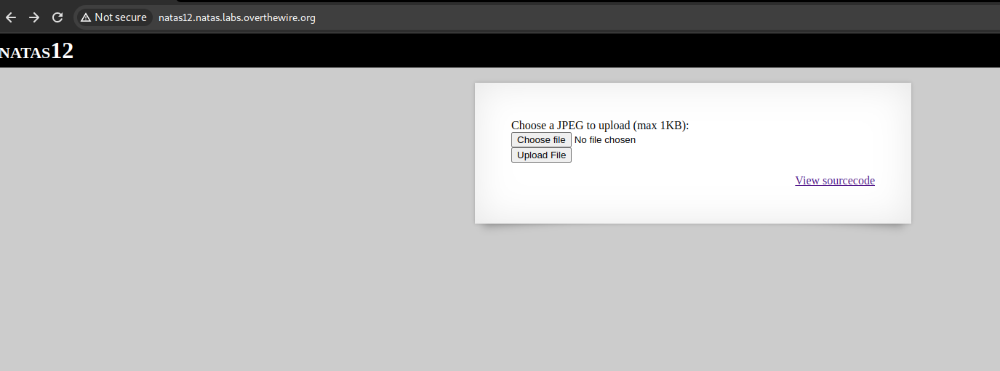

# Level 26 - Level 27

```
Username: natas27
Password: PSO8xysPi00WKIiZZ6s6PtRmFy9cbxj3
URL:      http://natas27.natas.labs.overthewire.org
```

## Overview

This time we got an login form with a link to the source code.

<figure><figcaption></figcaption></figure>

***

## Source Code Analysis

Let's take a look at the source code.

This PHP code appears to be a simple authentication system with a MySQL database. Let's break down the main components:

### **Database Structure**

<figure><figcaption></figcaption></figure>

* There's a table named `users` with columns `username` and `password`.
* The `CREATE TABLE` statement in the comments defines the structure.

### **Functions**

* `checkCredentials`: Takes a username and password, checks if the combination exists in the database, and returns `True` if valid.

<figure><figcaption></figcaption></figure>

* `validUser`: Checks if a given username exists in the database and returns `True` if it does.

<figure><figcaption></figcaption></figure>

* `dumpData`: Retrieves data for a given username from the database and returns it as a string.

<figure><figcaption></figcaption></figure>

* `createUser`: Creates a new user with a given username and password.

<figure><figcaption></figcaption></figure>

### **Form Handling**

* The script checks if the `username` and `password` parameters are present in the `$_REQUEST`.
* If submitted, it connects to the MySQL database and performs the following actions:
  * Checks if the user already exists.
    * If yes, it checks the credentials.
      * If valid, it displays a welcome message and the user's data.
      * If invalid, it shows an error message.
    * If the user doesn't exist, it creates a new user.
* If not submitted, it shows an HTML form for entering a username and password.

<figure><figcaption></figcaption></figure>

### **Security Considerations**

* There are some security checks, such as ensuring the username doesn't contain extra whitespaces using the `trim()` function and limiting the length of usernames and passwords to 64 characters.
* The code uses `mysqli_real_escape_string` to prevent SQL injection.


* The code mentions that the database is cleared every 5 minutes.
* There's a comment indicating a bug in the `dumpData` function that was fixed by using `print_r($row, true)`.


***

## Identifying the Vulnerability

If we take a close look at the `dumpData()` function, it first fetches all the users with the username `$user` and it loops through the results, if it contains more than one value \[ i.e. an array of values ], printing every value.

<figure><figcaption></figcaption></figure>

We know that there should be a username "`natas28`", based on the previous natas levels, which has the password for the next level. Since, the `dumpData()` function prints all the values, we can leverage this vulnerability by creating another user with the same username "`natas28`" \[ its possible, since username field in the database structure don't have the `UNIQUE` constraint ], which will print all the passwords for the users with the same username, including the password for the next level.

***

## Generating the Payload

### Things to Bypass

Let's take a close look at the `createUser()` function

<figure><figcaption></figcaption></figure>

The `trim()` function removes any white-spaces in the beginning or end of the string.



Next, the `mysqli_real_escape_string()` function, allows only 64 characters and if it is more than the limit, it takes only the first 64 characters, cutting off the remaining characters. Also it escapes /removes the following characters: `NUL (ASCII 0), \n, \r, , ', ",` and `Control-Z`



<figure><figcaption></figcaption></figure>

To leverage the above mentioned vulnerability, we have to create another user with the name `natas28`, but the `validUser()` function checks whether the username already exists.

<figure><figcaption></figcaption></figure>

So, we have to generate a payload that,

* Bypasses the `validUser()` function.
* Bypass the `trim()` function from `createUser()` function.
* Bypass the `mysqli_real_escape_string()` function from createUser() function.

and should result with the username `natas28`.

### **Bypassing `validUser()` Function**

We can generate a username by appending a space or special character, which is not recognized by the `validUser()` function.

```
# Payload with a white space appended at the end
natas28 
```

### **Bypassing `trim()` Function**

Since the `trim()` function removes leading and trailing white spaces, we can append another charcter/string at the end to the previously generated payload, so that the spaces aren't removed.&#x20;

```
# Payload with a white space, that bypasses the trim() function
natas28 someone
```

### **Bypassing `mysqli_real_escape_string()` Function**

Create a username that exceeds 64 characters or includes characters that are normally escaped, potentially bypassing the limitations imposed by `mysqli_real_escape_string()`.

In this case, we can replace the white-spaces with null character \[ ASCII 0 ] in url encoded format `%00`

```
# Payload that bypasses the function mysqli_real_escape_string()
natas28%00someone
```

### Final Payload

Combine the above mentioned strategies to create a payload that includes all necessary elements for bypassing both `validUser()` and `trim()` functions, and potentially exploiting the limitations of `mysqli_real_escape_string()`.

The following python script generates such a payload.

```python
print("natas28" + "%00" * (64 - len("natas28")) + "someone")
```

<figure><figcaption></figcaption></figure>


```url
# Final Payload

natas28%00%00%00%00%00%00%00%00%00%00%00%00%00%00%00%00%00%00%00%00%00%00%00%00%00%00%00%00%00%00%00%00%00%00%00%00%00%00%00%00%00%00%00%00%00%00%00%00%00%00%00%00%00%00%00%00%00someone
```


***

## Getting the Password

I captured the login request with burpsuite and replaced the username value with the payload that we generated and the password as `test`, which worked successfully.

<figure><figcaption></figcaption></figure>

Now to get the credential, login with the username `natas28` and the password that we gave, `test`, to get the password for the next level.

<figure><figcaption></figcaption></figure>
